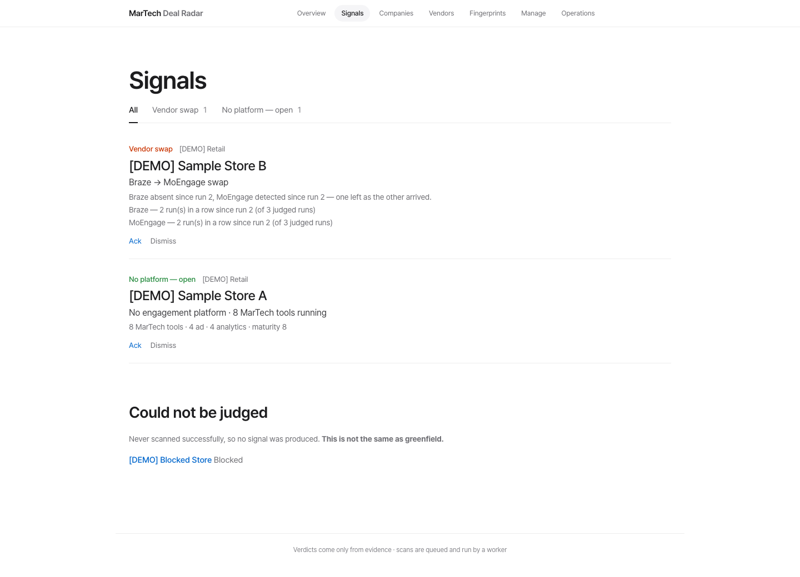
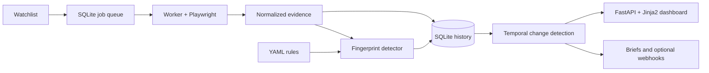

# MarTech Radar

**Evidence-based change detection for marketing technology stacks.**

A personal project by [Yongjun Jeong](https://github.com/YongjunJeong), connecting
MarTech domain knowledge with browser automation, temporal data modeling and
an inspectable decision system.

MarTech Radar observes public websites, identifies technology signals, and
tracks adoption, removal and migration over time. Each finding links back to
the evidence that produced it. A failed observation remains unknown instead
of becoming a false business signal.

**Python · Playwright · FastAPI · SQLite · Jinja2**

**105 vendor fingerprints · 6 categories · English / Korean UI**

[Run the demo](#run-the-offline-demo) · [Design decisions](#design-decisions) ·
[Explore the code](#explore-the-code) · [Validation](#validation)



*All companies and observations shown above are synthetic. They do not describe
any real organization's technology stack.*

## The problem

A technology lookup gives a snapshot. A useful monitoring tool must also answer:
**what changed, what evidence supports it, and is the comparison trustworthy?**

That distinction matters when a site blocks the browser, a consent banner
prevents tags from loading, or a redirect lands on another company's domain.
Treating every missing tag as a removal produces misleading signals.

I built the project around that ambiguity: collect observations, retain their
provenance, distinguish direct evidence from references, and compare only
observations that meet the quality rules.

## What the application does

- **Observe:** visit desktop or mobile pages with Chromium and collect network,
  runtime, script, storage-name and other evidence.
- **Explain:** show `DETECTED`, `PROBABLE` or `NOT_DETECTED` verdicts with matched
  patterns and evidence layers.
- **Track:** identify arrivals, sustained absences, platform migrations and
  changes in the destination website.
- **Investigate:** drill down from the dashboard into a company's timeline,
  vendor matches and evidence-backed brief.
- **Operate:** manage watchlists, queue scans, apply tier-based schedules,
  acknowledge signals and optionally deliver webhook notifications.

The default configuration has no preferred vendor. All vendors use the same
scoring rules. An optional home-vendor setting changes signal classification;
it does not give that vendor a detection advantage.

## Design decisions

| Challenge | Decision | Why it matters |
|---|---|---|
| A vendor name appears in a bundle or CSP header | Separate direct evidence from indirect references | A reference alone cannot establish `DETECTED` |
| One vendor has many matching patterns | Score each evidence layer once | More patterns do not automatically mean more confidence |
| A site times out, blocks access or returns a thin page | Exclude untrustworthy scans from comparison | A collection failure does not become a removal |
| A tag disappears for one visit | Require at least two trustworthy absences spanning seven days | A transient miss stays a candidate rather than a confirmed removal |
| A watched URL starts landing on another domain | Track landing-host changes separately | Observing a different site is not treated as a stack migration |
| Detection rules improve | Retain evidence and re-run detection without revisiting sites | Historical findings can be reviewed under the updated rules |
| Browser work is slow | Queue work in SQLite and process it with a worker | Dashboard requests do not have to wait for scans |

These are explicit heuristics, not guarantees about a company's contracts or
actual adoption. `NOT_DETECTED` means the tool did not observe the technology
on the visited pages.

## Architecture



Collection, detection and change analysis are separate modules. Stored evidence
can be classified again when a fingerprint changes; every run records a hash
of its fingerprint registry.

SQLite and server-rendered pages keep the application deployable on one machine
without a database server, frontend build pipeline or cloud account. The scope
is a single-operator workspace. There is no distributed worker service or
multi-tenant identity system.

## Run the offline demo

Requires **Python 3.11+**. The commands below use a macOS/Linux shell.

```bash
git clone https://github.com/YongjunJeong/martech-radar.git
cd martech-radar
python3 -m venv .venv
.venv/bin/python -m pip install -e .
.venv/bin/python demo/seed.py data/portfolio-demo
bin/radar --home data/portfolio-demo serve
```

Open [localhost:8848](http://127.0.0.1:8848). The demo creates three fictional
companies over three observations and exercises the real detector and change
analysis code. No browser download or website visit is needed.

Try **Signals → Sample Store B** to inspect a migration and its evidence.
The blocked company stays in the unjudged group. Every demo company is labeled
`[DEMO]`; the generator refuses to overwrite an existing destination.

Add `--lang ko` to the serve command for the Korean UI. Do not run `batch` on
the fictional `.example` targets.

## Scan your own watchlist

```bash
.venv/bin/playwright install chromium
cp targets.example.yaml targets.yaml
cp radar.example.toml radar.toml
# Replace the example targets with the public sites you want to observe.
bin/radar watchlist import targets.yaml
bin/radar batch
bin/radar serve
```

For scans queued through the dashboard, run `bin/radar worker --watch` in a
second terminal. Keep the dashboard and worker on the same machine with a local
SQLite workspace. Use `--home DIR` or `RADAR_HOME` to select another workspace.

The collector respects `robots.txt` by default and paces requests per site.
Per-target exceptions require a recorded reason. It does not log in, click
consent banners or solve CAPTCHAs. Consent-gated and server-side technologies
may therefore remain unobserved.

Keep the dashboard on localhost; use an SSH tunnel for remote access. The
URL guard does not isolate browser subrequests or protect against DNS changes.
An access token is not a substitute for network isolation.

## Validation

The test suite covers browser fixtures, evidence normalization, detection,
temporal comparisons, persistence, worker tasks and dashboard behavior.
It uses local fixture pages and synthetic observations rather than customer data.

```bash
.venv/bin/python -m pip install -e ".[dev]"
.venv/bin/playwright install chromium
.venv/bin/ruff check .
.venv/bin/python -m pytest tests/ -q
```

The repository previously recorded 273 passing tests on Python 3.13. The current
2026-10-09 refinement reran **273 tests and Ruff successfully** on Python 3.11. This is a functional test result, not a detection-accuracy benchmark.
No production impact or accuracy rate is claimed.

## Explore the code

| Area | Entry point |
|---|---|
| Browser collection and evidence handling | [`collector.py`](radar/collector.py), [`evidence.py`](radar/evidence.py) |
| Rules and explainable verdicts | [`detector.py`](radar/detector.py), [`fingerprints/`](radar/fingerprints/) |
| Temporal rules and migration logic | [`signals.py`](radar/signals.py) |
| Persistence, queue and worker | [`store.py`](radar/store.py), [`worker.py`](radar/worker.py) |
| Dashboard and operations | [`app.py`](web/app.py), [`templates/`](web/templates/) |
| Reproducible demonstration | [`seed.py`](demo/seed.py), [`test_demo.py`](tests/test_demo.py) |

Add or adjust vendor patterns in the YAML registry, then use
`bin/radar redetect --diff` to inspect how stored verdicts change. Rules are
inspectable and deterministic; no LLM or vendor API key is required.

## Documentation and data

[한국어 사용 설명서](docs/GUIDE.ko.html) ·
[Configuration example](radar.example.toml) ·
[Data and demo notes](docs/PUBLICATION.md)

Watchlists, scan databases, logs, backups and credentials are excluded from Git.
Cookie and storage values are not collected, but selected vendor configuration
identifiers, URLs and free-text evidence can still reveal business information.
Keep real scan outputs private and use the synthetic demo for public screenshots.

## Next engineering work

Keep observation quality separate from business conclusions. For a controlled cloud
deployment, first isolate browser/network access and authenticate the dashboard.
Then measure queue age, scan failure reasons and job retries; test worker restart
and backup recovery before shared operation. These are planned checks, not existing
production reliability results.

## License

[MIT](LICENSE). Vendor names identify supported technologies from an independent,
third-party perspective. This project is not affiliated with or endorsed by them.
